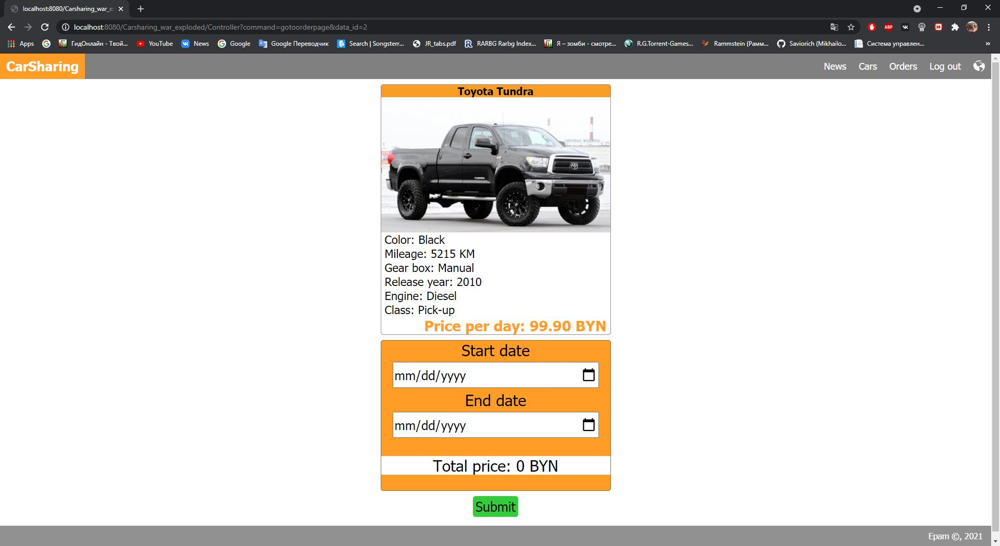

# Carsharing
## Business use case

A **client** fills out an **order**.
- Can view comments
- Leave comments if he has the returned order of the car

The administrator:

- manages cars, cars information, news;
- views received orders;
- views comments for cars

## Demo

### News page

### Login page

### Order page

### Payment

### Orders page, admin view

### Car page, admin view

-----
Alexey Mikhailov, 2021
